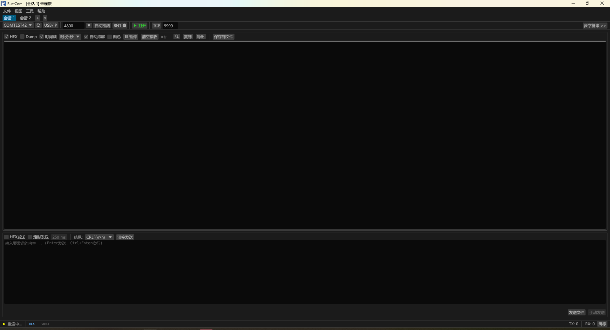

# RustCom - 串口调试助手

**跨平台 | AI 可操控 | 嵌入式开发者的终极串口工具**

[]()
[]()

> 4.8MB 单文件，零依赖安装，开箱即用。
> **全球首个支持 AI Agent TCP 远程全量操控的串口调试工具。**



---

## 下载

| 平台 | 下载 | 说明 |
|------|------|------|
| **Windows** | [rustcom.exe](https://github.com/suding-china/rustcom-release/releases/latest) | 双击运行，无需安装 |
| **Linux** | [rustcom](https://github.com/suding-china/rustcom-release/releases/latest) | `chmod +x rustcom && ./rustcom` |

---

## 为什么选择 RustCom？

| 痛点 | 传统工具 | RustCom |
|------|---------|---------|
| 多设备调试 | 开多个窗口 | **多标签页**，Ctrl+T 新建 |
| AI 自动化 | 不支持 | **49 个 TCP 命令**，JSON 自描述 API |
| AT 命令测试 | 手动发送+肉眼看 | **SEND_AND_WAIT** 原子操作，自动计时 |
| 设备模拟 | 另写脚本 | **自动应答规则**，收到 AT 自动回 OK |
| 日志着色 | 固定规则 | **自定义颜色规则** + ANSI 色 |
| 时序分析 | 无 | **响应延迟实时测量** (ms) + 相对时间戳 |
| 新设备接入 | 手动刷新 | **USB 热插拔自动检测** + 波特率自动检测 |
| 换电脑 | 重新配置 | 4.8MB 单文件，配置自动保存 |

---

## 功能一览

### 串口通信
- 26 种波特率（含 ESP32 专用 74880）
- 5/6/7/8 数据位 | 1/2 停止位 | None/Odd/Even 校验
- 硬件/软件流控 | DTR/RTS 控制
- **自动波特率检测** | **USB 热插拔自动发现**
- 串口冲突检测（多会话不能打开同一端口）

### 接收显示
- **HEX / 文本 / Hex Dump** 三种显示模式
- 关键字颜色高亮（ERROR 红 | WARN 黄 | DEBUG 灰）
- **自定义颜色规则** + ANSI 转义色完整支持
- 时间戳三种格式：`[HH:MM:SS.mmm]` | `[+1.234s]` 相对时间 | `[日期时间]`
- 搜索高亮 + **行过滤模式**（只显示匹配行）
- 智能滚动（手动翻页自动暂停，点击"↓ 底部"恢复）
- 行计数 | 一键复制 | 导出（文本 / Hex Dump）
- 保存到文件（.bin 原始字节 / .txt 带时间戳）

### 发送功能
- 文本 / HEX 双模式 | **HEX 实时校验**（输入即验证）
- 转义序列：`\n` `\r` `\t` `\0` `\\` `\xNN`
- 发送字节预览 | Enter 发送 | Ctrl+Enter 换行
- 发送历史 | **重发上次** 按钮 | 定时自动发送
- 文件发送 | 右键菜单快捷插入转义序列和 AT 命令

### 多字符串快捷面板
- 20 条快捷发送按钮，可自定义标签
- 序列发送 | 单条/全部/定时自动发送
- **导入/导出**（从文本文件加载命令列表）

### 多标签多会话
- Ctrl+T 新建 | Ctrl+W 关闭 | Ctrl+Tab 切换
- 双击重命名 | 右键菜单（重命名/复制配置/关闭）
- 每个会话完全独立，后台持续接收不丢数据

### 工具箱
- **Modbus RTU** 帧构造 + 帧解析（CRC 自动校验）
- 校验和计算器（CRC-16 Modbus/CCITT | SUM8 | XOR）
- ASCII 码表 | 进制转换器

---

## AI 远程操控（TCP 协议）

RustCom 内置 TCP 服务端，**Claude Code / 任何脚本** 都可以通过 telnet 远程控制所有功能。

### 快速开始

```bash
# 1. 在 RustCom 中开启 TCP 转发（点击工具栏 TCP 按钮）
# 2. 用 telnet 连接
telnet localhost 9999

# 发现所有命令
#CMD LIST_COMMANDS
#CMD LIST_KEYS

# 连接串口
#CMD CONNECT COM3 115200

# AT 命令自动化
#CMD SEND_AND_WAIT AT+RST ||| OK 3000

# 查看最近日志
#CMD TAIL_RX 20

# 过滤错误
#CMD GREP_RX ERROR

# 设备模拟
#CMD ADD_AUTO_REPLY AT ||| OK
```

### 49 个 TCP 命令

| 类别 | 命令 |
|------|------|
| **基础** | HELP STATUS PORTS CONNECT DISCONNECT PING RESET |
| **收发** | SEND SEND_HEX CLEAR_RX CLEAR_TX PAUSE_RX RESUME_RX |
| **参数** | GET SET LIST_KEYS (33 GET + 25 SET 键) |
| **搜索** | SEARCH GREP_RX GET_RX TAIL_RX |
| **多字符串** | SEND_MULTI SEND_MULTI_ALL SEQ_START SEQ_STOP GET/SET/LIST_MULTI |
| **自动化** | WAIT_FOR SEND_AND_WAIT ADD/LIST/DEL_AUTO_REPLY |
| **颜色规则** | ADD/LIST/DEL_COLOR_RULE |
| **会话管理** | LIST/SWITCH/NEW/CLOSE_SESSION |
| **文件** | SAVE_RX SAVE_RX_STOP SAVE_CONFIG |
| **元数据** | LIST_COMMANDS DESCRIBE_UI STATS SUBSCRIBE UNSUBSCRIBE |
| **安全** | AUTH (TOKEN 认证) | BATCH...END (批量执行) |

---

## 快捷键

| 快捷键 | 功能 | 快捷键 | 功能 |
|--------|------|--------|------|
| Ctrl+O | 打开/关闭串口 | Ctrl+T | 新建标签 |
| Ctrl+F | 搜索 | Ctrl+W | 关闭标签 |
| Ctrl+P | 暂停/继续 | Ctrl+Tab | 切换标签 |
| Ctrl+L | 清空接收 | Ctrl+M | 多字符串面板 |
| Ctrl+S | 保存配置 | Ctrl+= / - | 放大/缩小 |
| Ctrl+Q | 退出 | Ctrl+0 | 重置缩放 |
| Enter | 发送 | Ctrl+Enter | 换行 |
| Up/Down | 发送历史 | Esc | 关闭搜索/菜单 |

---

## 命令行参数

```
rustcom --port COM3 --baud 115200 --connect    启动即连接
rustcom --tcp-port 9999                        指定 TCP 端口
rustcom --tcp-token mytoken                    设置 TCP 认证密码
```

---

## 配置文件

配置自动保存在 `~/.rustcom/rustcom.conf`，支持多会话配置。

可通过菜单 **文件 → 导出/导入配置** 备份和迁移。

---

## 反馈与问题

如有问题或建议，请在 [Issues](https://github.com/suding-china/rustcom-release/issues) 中提交。
